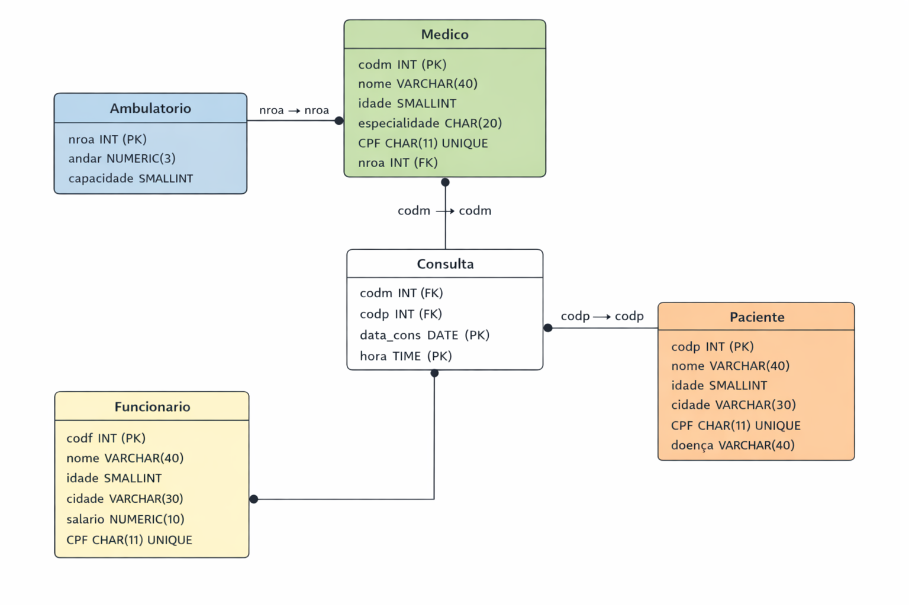

# 🏥 Banco de Dados - Clínica

Projeto de banco de dados relacional desenvolvido para simular o funcionamento de uma clínica médica.

---

## 📌 Funcionalidades

* Cadastro de médicos, pacientes e funcionários
* Controle de consultas
* Relacionamento entre tabelas (chaves estrangeiras)
* Consultas SQL com:

  * JOIN
  * UNION
  * Subqueries
  * Funções de agregação

---

## 🗂 Estrutura do Projeto

```
clinica-database-mysql
 ├── sql/
 │   ├── 01_create_database.sql
 │   ├── 02_create_tables.sql
 │   ├── 03_inserts.sql
 │   └── 04_queries.sql
 ├── diagrama/
 │   └── diagrama.png
 └── README.md
```

---

## 🧠 Modelagem do Banco

* **Ambulatorio**: salas e capacidade
* **Medico**: dados dos médicos
* **Paciente**: dados dos pacientes
* **Funcionario**: equipe da clínica
* **Consulta**: agendamento de consultas

---

## 🗺 Diagrama do Banco



---

## ⚙️ Tecnologias

* MySQL

---

## ▶️ Como executar

1. Executar o arquivo:

   * `01_create_database.sql`
2. Executar:

   * `02_create_tables.sql`
3. Inserir dados:

   * `03_inserts.sql`
4. Testar consultas:

   * `04_queries.sql`

---

## 💡 Observações

Projeto desenvolvido para fins educacionais, com foco em:

* modelagem de dados
* prática de SQL
* organização de scripts

---

## 🚀 Autor

Projeto desenvolvido por Marcos Vinícius
